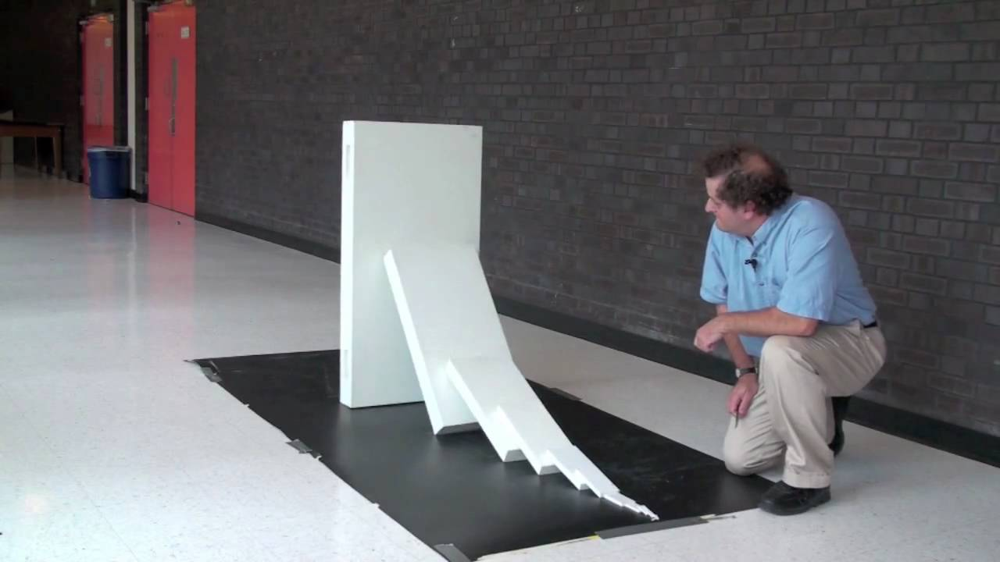
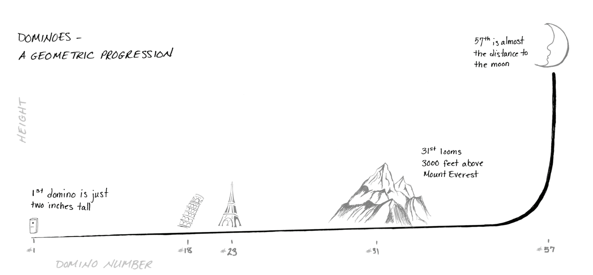

# ANO NOVO

# TEMPO DE REFLETIR

## Quantas vezes planejou e não conseguiu?

# COMO PLANEJAR?

# 1. PLANEJE COM DEUS

> “Contudo, Deus lhe disse: ‘Insensato! Esta mesma noite a sua vida será exigida. Então, quem ficará com o que você preparou?’ 

Lucas 12:20

> Mas Deus lhe disse: “Seu tolo! Esta noite você vai morrer; aí quem ficará com tudo o que você guardou?” 

Lucas 12:20

> Consagre ao Senhor tudo o que você faz, e os seus planos serão bem-sucedidos.

Provérbios 16:3 (NVI)

> Porque sou eu que conheço os planos que tenho para vocês’, diz o Senhor, ‘__planos de fazê-los prosperar__ e não de causar dano, planos de __dar a vocês esperança e um futuro__.

Jeremias 29:11 (NVI)

# 2. FOCO

> Peça-a, porém, com fé, sem duvidar, pois aquele que duvida é semelhante à onda do mar, levada e agitada pelo vento.
Não pense tal pessoa que receberá coisa alguma do Senhor, 
**pois tem mente dividida e é instável em tudo o que faz.**

Tiago 1: 6-8

## Esqueça listas de final de ano

# O QUE É ESSENCIAL PARA VOCÊ?

O que é imprescindível; muito necessário; o que não pode ser deixado de lado ou ignorado; fundamental

Lista do que é essencial

- item 1

- item 2

# 3. PENSE pequeno

# 4. PLANEJE NO LONGO PRAZO

> Os planos bem elaborados levam à fartura; mas o apressado sempre acaba na miséria.

Provérbios 21:5 (NVI)

# NÃO CONTE SEUS PLANOS

> Mas, quando você orar, vá para seu quarto, feche a porta e ore a seu Pai, que está em secreto. Então seu Pai, que vê em secreto, o recompensará.

Mateus 6:6 (NVI)

# 4. SIMPLIFIQUE
